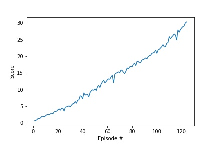

# Continuous control using DDPG

In this project, we use Deep Deterministic Policy Gradient to solve a continuous control problem in Unity environment, which is called Reacher. The reacher is a double-jointed mechanical arm, our target is to make decision to keep the arm in goal position as long as possible. 

### 1. Deep Deterministic Policy Gradient (DDPG)

DDPG is an actor-critic method which solved reinforcement learning problems of continuous action space. DDPG uses a critic network $Q(s, a|\theta^{Q}$) to generate $Q$ value for specific action and a actor network $\mu(s|\theta^{\mu})$ to provide deterministic action given state $s$.

For a given state $s_{t}$, we first use the actor to generate action $a_{t}$, we also add noise from Ornstein-Uhlenbeck process to the action generated from the actor network to encourage exploration. 

We then execute $a_{t}$ to get reward $r_{t}$ and observe the next state $s_{t+1}$. We store the observed transition $(s_{t}, a_{t}, r_{t}, s_{t+1})$ in a ReplayBuffer. All the saved transitions are used as experiences later to update the actor and critic network. After we collect a certain number of experiences, we randomly sample some of them to update the networks. 

We use $N$ samples from ReplayBuffer to update the two networks. For each experience indexed by $i$, we minimize the mean square error between the evaluated Q values of state $s_{i}$ of target critic network and the critic network itself. The target Q value y_{i} estimated by target critic network is $y_{i} = r_{i} + \gamma Q'(s_{i+1}, \mu'(s+{i+1}|\theta^{\mu'})|\theta^{Q'})$, where $Q'(\cdot)$ indicates the target critic network and $\mu'(\cdot)$ represents the target actor network. $y_{i}$ is calculated by Temporal Difference (0) (TD(0)). The mean squared error $L=\frac{1}{N}\sum_{i} (y_{i} - Q(s_{i}, a_{i}|\theta^{Q}))^{2}$.

The actor network is updated by sampled policy gradient. Here we use gradient ascent to maximize sampled $Q$ value of state $s$. The gradient is calculated by:
$\nabla_{\theta^{\mu}} J \approx \frac{1}{N}\sum_{i} \nabla_{a} Q(s, a|\theta^{Q})|_{s=s_{i}, a=\mu(s_{i})} \nabla_{\theta^{\mu} \mu(s|\theta^{\mu})}|_{s_{i}}$

We also use a parameter $\tau$ to soft update the networks:
$\theta \leftarrow \tau \theta + (1-\tau)\theta$

### 2. Chosen hyperparameters of DDPG

The buffer size of ReplayBuffer: $10^{6}$

The batch size: $128$

The discount factor $\gamma$: $0.99$

The soft update factor $\tau$: $10^{-3}$

The learning rates of actor and critic network: $10^{-3}$

The update frequency: $20$

The learning times of each update: $10$

The epsilon for noise update: $1$ at the first time step, every update step decay with $10^{-6}$

The exploration action from actor network is calculated as: $actor(state) + epsilon * OUnoise$, where actor(state) is the actor network output, OU noise is the noise from Ornstein-Uhlenbeck process.

#### The network structure of  actor network:

${Relu} ({\text{FC layer}: 400 \text{units}}) \rightarrow \text{batch normalization} \rightarrow {Relu} (\text{FC layer}: 300 \text{units}) \rightarrow tanh(\text{FC layer}: \text{action_size})$ 
where FC layer means fully connected layer, the last layer outputs units of action size.

#### The network structure of  critic network:

Replace the output units of last layer of actor network by 1 and use linear activation function.

### 3. Plot of results

The average scores over consecutive 100 episodes are shown below, the training immeadiately stopped after the average scores of all agents reach to 30:

### 4. Future Improvements

Try to implement PPO and TRPO to this task.
